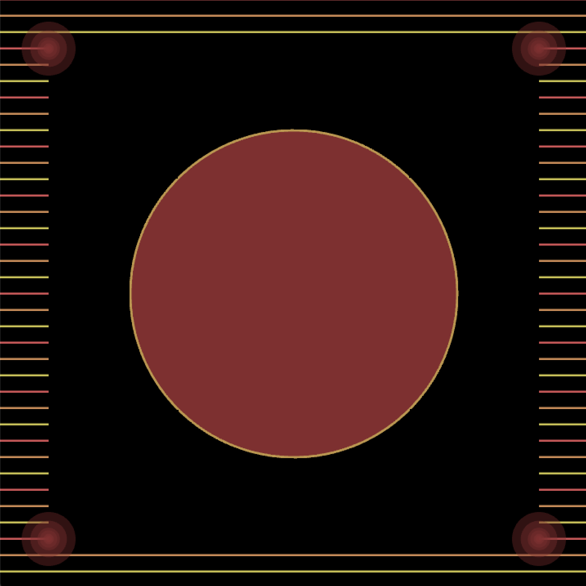
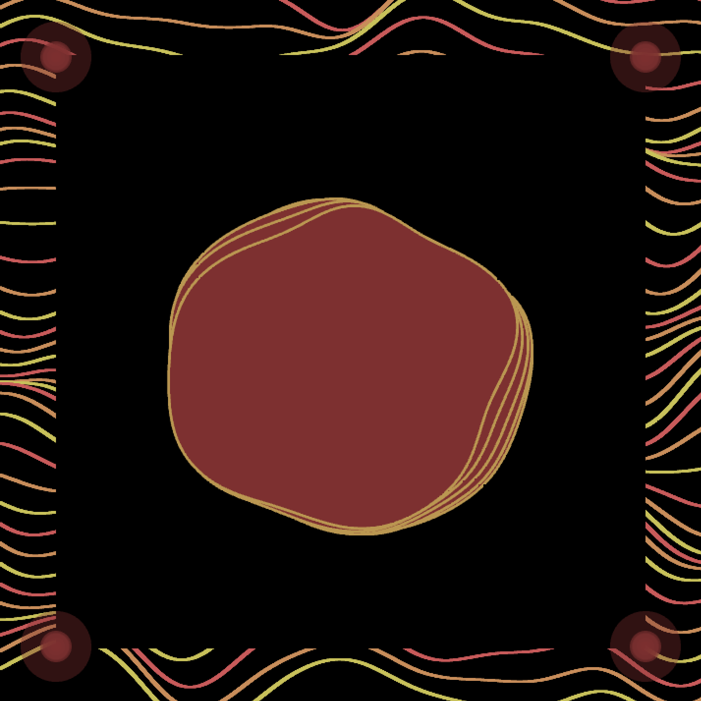
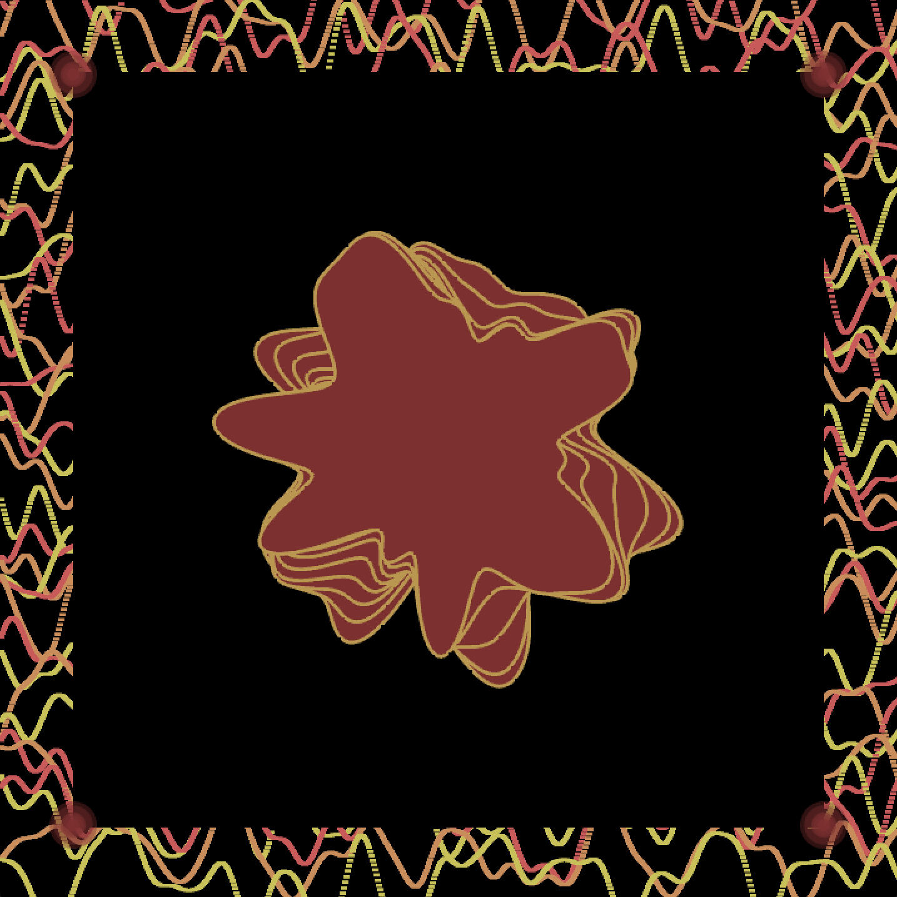

# Geometric/Organic Shapes - Visualizer

## Recording
https://youtu.be/urmnSL6rA4g

## Initial Idea
For my final assignment, I decided to work off my previous motion assignment by sticking to the same theme; the idea was to explore geometric shapes, such as straight lines and circles and how the feeling can be changed through adding slight modulations - for example, on the circles, using noise to enhance the shapes. I wanted the composition to start off purely made of lines and circles with no modulations first. It would ideally start to be more "flowy" over time and eventually become irregular and imperfect (pretty much the opposite of geometric shapes.) I will take my previous assignment as inspiration and use noise in order to modulate the shapes. 

## Process
I started by searching for different ways I could create what I wanted. The first thing I did was made an audio reactive shape (circle) to stay consistent throughout the sketch. https://youtu.be/IiTsE7P-GDs. The radius is determined by the bands, as well as the smoothness : fftSmooth[i] *= 0.5f; and goes up by *150. I wanted the circles to react in a relatively fast pace so I set the fftSmooth to 0.5f.
 

I looked around for inspiration on how to use noise to manipulate shapes; i wanted to do something a little different than my previous assignment. I was looking for something that could start of as geometric and be manipulated i.e using noise to look as if it's flowing all over the screen. I also knew that I wanted to incorporate audio in some way (something like an audio visualizer), however I also wanted to be able to manually control the visual on screen. I started first by using a GUI to control the lines on screen, however I didn't like the way it felt - I wanted it to be more like a keyboard in which I could just press a key to produce a different sound (in this case, a different visual)
  

ic: https://junkiyoshi.com/insta20180109 & https://junkiyoshi.com/openframeworks20190520/
  

for (int x = ofGetWidth() * 0; x < ofGetWidth(); x += 1) {
                noise_value = ofMap(ofNoise(x * **lines**, y * **lines**, ofGetFrameNum() * **lines**), 0, 1, -50, 50);
                ofDrawLine(x, y + noise_value, x + 5, y + noise_value);
 
 
I created float and int values for the **lines** and this manipulates the height of the waves it would create, as well as the speed it's at. I then used the keyPressed function (switch key) and added the values for each case from 1-9. for example: 
  
switch (key) {
            case '0':
                lines = 0;
                flow = 0;
                pulse = 1;
                layers = 1;
                break;
            case '1':
                lines =0.001;
                flow = 0.001;
                pulse = 0.9;
                layers = 1;
                break;
   
the **lines** manipulate height and speed (values 0 - 0.03) **flow** manipulates the circle in the middle (values 0 - 0.009) **pulse** manipulates the circle's radius across time (1 - 0.4) **layers** manipulates the amount of circles drawn (1-9)

## Outcome
I think I like how the final product turned out. I feel like it brought out the intention a lot clearer than my previous assignment and the audio helped to do that as well. I like how the shapes flowed and the audio reactive circles. However, I wish I had more time to work on the composition itself. Although it was pretty close to what I envisioned it to be, I would love to experiment more with placing maybe multiple circles on screen and maybe even adding in other shapes if that worked. 

## Gallery 

  
  
  

